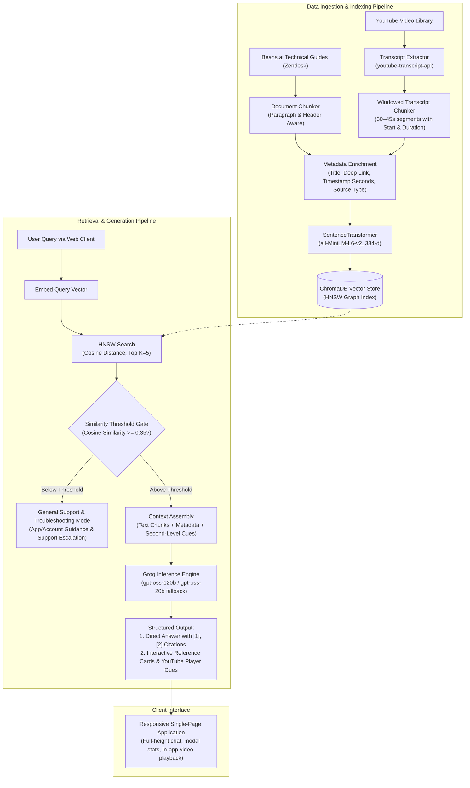

# Beans.ai Support Assistant: Retrieval-Augmented Generation (RAG) System

A Retrieval-Augmented Generation (RAG) support system built for Beans.ai product documentation and technical video resources.

The architecture combines dense vector retrieval with second-level timestamp cues for video tutorials and direct text citations for technical documentation. The assistant delivers grounded, step-by-step guidance for support queries alongside interactive reference cards that jump directly to relevant video timestamps.

---

## Table of Contents
- [1. System Overview](#1-system-overview)
- [2. System Architecture](#2-system-architecture)
- [3. Engineering Decisions & Trade-Offs](#3-engineering-decisions--trade-offs)
  - [3.1. Executive Summary](#31-executive-summary)
  - [3.2. Vector Indexing: HNSW vs. Brute-Force Flat Search](#32-vector-indexing-hnsw-vs-brute-force-flat-search)
  - [3.3. Distance Metric: Cosine Similarity](#33-distance-metric-cosine-similarity)
  - [3.4. Similarity Thresholding vs. Unconstrained Top-K](#34-similarity-thresholding-vs-unconstrained-top-k)
  - [3.5. Model Selection: Embeddings and Generation](#35-model-selection-embeddings-and-generation)
  - [3.6. High-Precision Video Timestamp Chunking](#36-high-precision-video-timestamp-chunking)
  - [3.7. Citation UX](#37-citation-ux)
- [4. Repository Structure](#4-repository-structure)
- [5. Installation and Setup](#5-installation-and-setup)
- [6. Running the System](#6-running-the-system)
- [7. Interface Design](#7-interface-design)
- [8. Production Roadmap](#8-production-roadmap)

---

## 1. System Overview

Beans.ai provides location intelligence, mapping, wayfinding, dispatch, and routing infrastructure for delivery fleets, first responders, and logistics operations. Support inquiries span both written technical documentation (Zendesk Help Center) and official YouTube tutorial videos.

This system addresses several practical challenges:

1. **Multi-modal grounding** — ingestion of both structured technical guides and spoken video transcripts into a single semantic space.
2. **Second-level video cues** — deep-links to the exact second (e.g. `?t=134s`) in a video where a specific workflow or setting is demonstrated.
3. **Clean citation system** — minimalist numeric citation markers (`[1]`, `[2]`) mapped to structured source metadata cards, rather than inline clutter.
4. **General support fallback** — helpful troubleshooting guidance for account or app issues when no documentation passage is a strong enough match, instead of a hardcoded failure message.
5. **Cost-effective local infrastructure** — in-memory dense retrieval powered by local SentenceTransformers embeddings and persistent ChromaDB storage, with no per-query API cost on the retrieval side.

---

## 2. System Architecture



---

## 3. Engineering Decisions & Trade-Offs

### 3.1. Executive Summary

| Dimension | Decision | Alternatives Considered | Rationale |
| :--- | :--- | :--- | :--- |
| **Vector Indexing** | HNSW (ChromaDB default, `hnswlib`) | Flat (brute force), IVF | Sub-5ms search, O(log N) scaling, ~98%+ recall, no external server needed |
| **Distance Metric** | Cosine Similarity | Euclidean (L2), Dot Product | Invariant to chunk length; measures semantic angle rather than magnitude |
| **Retrieval Filtering** | Top-K (K=5) + minimum similarity threshold (τ ≥ 0.35) | Pure Top-K | Prevents hallucination on off-topic queries by rejecting weak matches |
| **Embeddings** | `all-MiniLM-L6-v2` (local, ONNX/SentenceTransformers) | OpenAI `text-embedding-3-small`, Cohere | Free, CPU-fast, no rate limits during batch transcript processing |
| **LLM Generation** | Groq `openai/gpt-oss-120b` (fallback: `openai/gpt-oss-20b`) | GPT-4o, Claude 3.5, Gemini 1.5 | Free tier, ~300 tok/s, 128k context, strong citation/structured-output compliance |
| **Timestamp Preservation** | Time-windowed transcript chunking (30–45s windows) | Fixed-token chunking | Preserves exact `start` second, enabling `?t=X` deep-links |
| **Citation UX** | Numeric pills `[1]` in chat + dedicated source cards below | Inline timestamps `【1†00:00】` | Keeps chat readable; timestamps/playback live only in reference cards |

---

### 3.2. Vector Indexing: HNSW vs. Brute-Force Flat Search

| Metric / Attribute | Flat (Brute Force) | HNSW (Hierarchical Navigable Small World) |
| :--- | :--- | :--- |
| Search complexity | O(N) linear scan | O(log N) graph traversal |
| Query latency | Increases linearly with corpus size | Sub-5ms across tens of thousands of items |
| Recall quality | 100% (exact) | ~98–99.5% (approximate) |
| Build overhead | None | Moderate graph construction time |
| Selected | No | **Yes** (ChromaDB `hnswlib`) |

**Rationale**: at the current corpus size (roughly 100–10,000 chunks across docs and transcripts), a flat index would already be fast enough — but HNSW was chosen to match production retrieval requirements without a later migration. ChromaDB's `hnswlib` backend gives logarithmic graph search with low memory overhead and persists locally to disk (`./data/chroma_db`) with no external container dependency.

---

### 3.3. Distance Metric: Cosine Similarity

**Why Cosine Similarity, not Euclidean (L2) or Dot Product:**

Chunk lengths vary widely in this corpus — concise feature summaries vs. detailed multi-step dispatch workflows vs. 30–45s transcript windows. L2 distance penalizes longer passages simply for having larger vector magnitude; cosine similarity normalizes that out and measures semantic orientation only.

---

### 3.4. Similarity Thresholding vs. Unconstrained Top-K

**The problem with pure Top-K**: an off-topic query (e.g. "what's the recipe for pasta?") still returns the 5 least-distant Beans.ai chunks — the model then has to synthesize an answer from context that isn't actually relevant, which is a direct path to hallucination.

**Two-stage gated retrieval (τ ≥ 0.35):**

1. Retrieve the top K=5 nearest neighbors via HNSW.
2. Compute similarity: `similarity = 1 - cosine_distance`.
3. Drop any chunk with `similarity < 0.35`.
4. **Adaptive branching**:
   - If ≥1 chunk clears the threshold → the LLM builds an evidence-grounded answer with inline citations.
   - If zero chunks clear it → branch into general support mode: general troubleshooting steps (check app updates, clear cache, verify location permissions) plus an escalation pointer to `support@beans.ai`, rather than a rigid "no answer" failure or a fabricated one.

---

### 3.5. Model Selection: Embeddings and Generation

| Component | Selected | Alternative Evaluated | Rationale |
| :--- | :--- | :--- | :--- |
| **Embeddings** | `all-MiniLM-L6-v2` (384-dim, local) | OpenAI `text-embedding-3-small`, Cohere | Zero cost, runs in-memory on CPU (<10ms/query), no rate limits during batch ingestion |
| **LLM generation** | Groq `openai/gpt-oss-120b` | GPT-4o, Claude 3.5 Sonnet, Gemini 1.5 | ~300 tok/s on Groq LPU hardware, 128k context (full retrieved-chunk injection without clipping), strong adherence to citation/structured-output format at low temperature (0.2) |
| **Fallback LLM** | Groq `openai/gpt-oss-20b` | Local 7B model | Automatic fallback on rate-limiting or primary endpoint disruption |

---

### 3.6. High-Precision Video Timestamp Chunking

Standard fixed-token chunking splits text without regard to time boundaries, which severs the link between a chunk of text and its position in the video.

**Windowed chunking algorithm:**

1. Extract transcript events `{text, start, duration}` via `youtube-transcript-api`.
2. Accumulate consecutive snippets into **30–45 second rolling windows** (roughly 80–120 spoken words), breaking at a natural pause where possible.
3. Anchor the chunk's start time to the timestamp of its first snippet.
4. Generate a deep-link: `https://www.youtube.com/watch?v={video_id}&t={round(start_seconds)}s`.
5. Attach structured metadata alongside the chunk text:
   ```json
   {
     "source_type": "youtube",
     "video_id": "PZ8X8Uo3vHk",
     "video_title": "Beans Route - How to Move a Pin",
     "start_seconds": 39,
     "timestamp_str": "00:39",
     "deep_link": "https://www.youtube.com/watch?v=PZ8X8Uo3vHk&t=39s"
   }
   ```
6. The client renders this as an interactive playback button (`▶ Play @ 00:39`) that opens an embedded player cued to the exact second.

---

### 3.7. Citation UX

Citations render as clean numeric pills (`[1]`, `[2]`) inline in the chat response, rather than embedding timestamps directly in the answer text (e.g. `【1†00:00】`). Clicking a pill scrolls to the corresponding source card below the answer, which carries the full metadata — document title or video title, snippet, and (for video) a `▶ Play @ MM:SS` button. This keeps the conversational text readable while still giving one click to the exact source and, for video, the exact second.

---

## 4. Repository Structure

```text
Beans/
├── backend/
│   ├── __init__.py
│   ├── config.py             # Environment settings and retrieval parameters
│   ├── discover_sources.py   # YouTube channel video discovery utility
│   ├── ingestion.py          # Unified document and transcript indexing pipeline
│   ├── main.py               # FastAPI application server and REST endpoints
│   ├── rag_agent.py          # Groq LLM agent with grounded retrieval logic
│   ├── scrape_youtube.py     # YouTube transcript extraction and windowing
│   ├── scrape_zendesk.py     # Zendesk knowledge base scraper
│   └── vector_store.py       # ChromaDB HNSW store and cosine search
├── data/
│   ├── beans_knowledge.json  # Curated technical documentation corpus
│   ├── youtube_chunks.json   # Processed timestamped video chunks
│   ├── youtube_videos.json   # Channel video catalog and metadata
│   └── chroma_db/            # Local persistent vector store
├── frontend/
│   ├── app.js                # Chat controller, API client, modal controls
│   ├── index.html            # Application markup
│   ├── style.css             # Layout, responsive design, component styling
│   └── beans_logo.png        # Official brand asset
├── .env.example               # Environment variables template
├── .gitignore                 # Git exclusion rules
├── requirements.txt            # Python dependencies
└── README.md                   # This file
```

---

## 5. Installation and Setup

### Prerequisites
- Python 3.10 or higher
- A Groq API key (available from [console.groq.com](https://console.groq.com/keys))

### Step 1: Clone and Set Up Virtual Environment
```bash
git clone <repository_url>
cd Beans

python -m venv venv

# Windows (PowerShell)
.\venv\Scripts\Activate.ps1

# Linux / macOS
source venv/bin/activate
```

### Step 2: Install Dependencies
```bash
pip install -r requirements.txt
```

### Step 3: Configure Environment Variables
```bash
cp .env.example .env
```

Ensure `.env` contains:
```env
GROQ_API_KEY=your_groq_api_key_here
GROQ_MODEL=openai/gpt-oss-120b
GROQ_FALLBACK_MODEL=openai/gpt-oss-20b
SIMILARITY_THRESHOLD=0.35
TOP_K=5
CHROMA_PERSIST_DIR=./data/chroma_db
```

---

## 6. Running the System

### Ingest Data and Build the Vector Store (Initial Setup)
```bash
python -m backend.ingestion
```

### Start the Application Server
```bash
python -m uvicorn backend.main:app --host 127.0.0.1 --port 8000
```

### Open the Application
```
http://127.0.0.1:8000
```

---

## 7. Interface Design

- **Focused chat layout** — full-height, clean conversation flow without distracting sidebars.
- **Interactive citation tags** — clicking `[1]`, `[2]` scrolls smoothly to the corresponding source card.
- **Second-level video player modal** — clicking `▶ Play @ MM:SS` opens an embedded YouTube player pre-cued to the exact second.
- **System metrics modal** — a "Stats" action in the top bar to inspect the active LLM model, embedding dimensions, vector store status, and chunk counts.

---

## 8. Production Roadmap

For scaling to broader production deployments:

1. **Cross-encoder re-ranking** — a secondary re-ranking pass (e.g. `bge-reranker-base`) on the top-15 retrieved candidates, to further improve precision on complex domain queries.
2. **HyDE (Hypothetical Document Embeddings)** — query expansion that generates a pseudo-answer prior to embedding search, for ambiguous phrasing.
3. **Automated audio transcription fallback** — Whisper API integration for uncaptioned webinars or screen-recorded product demos.